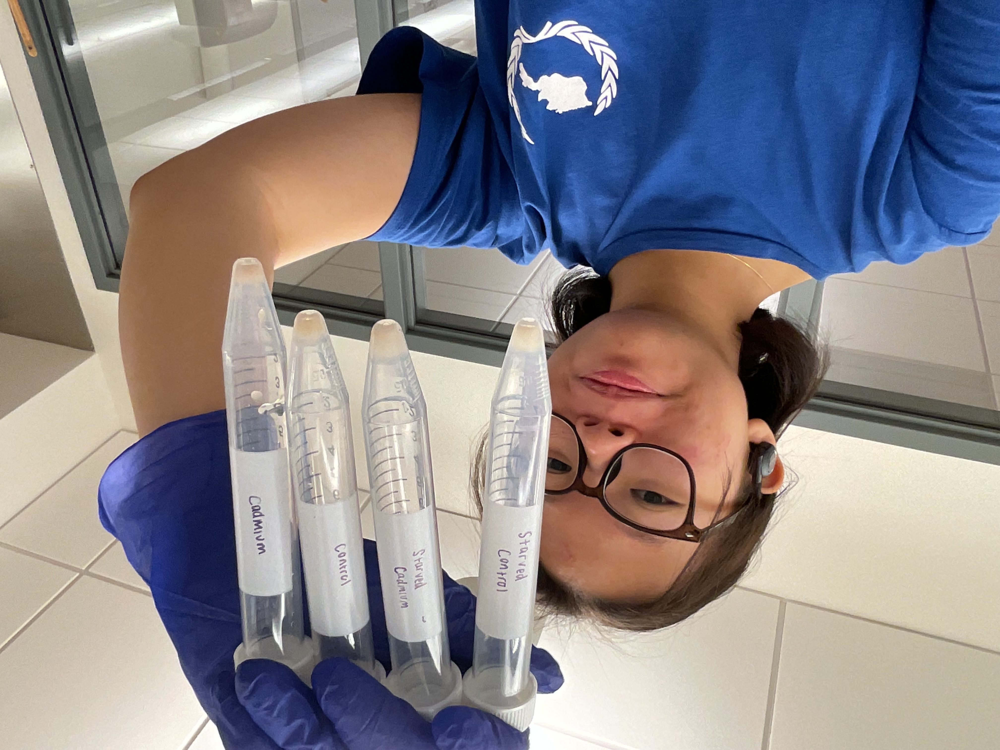
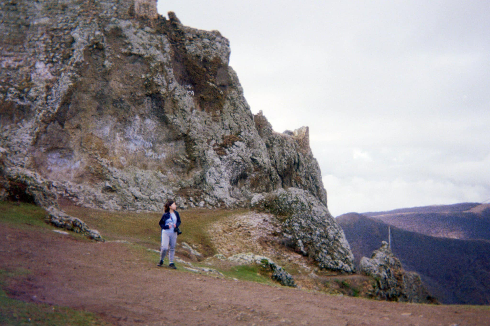
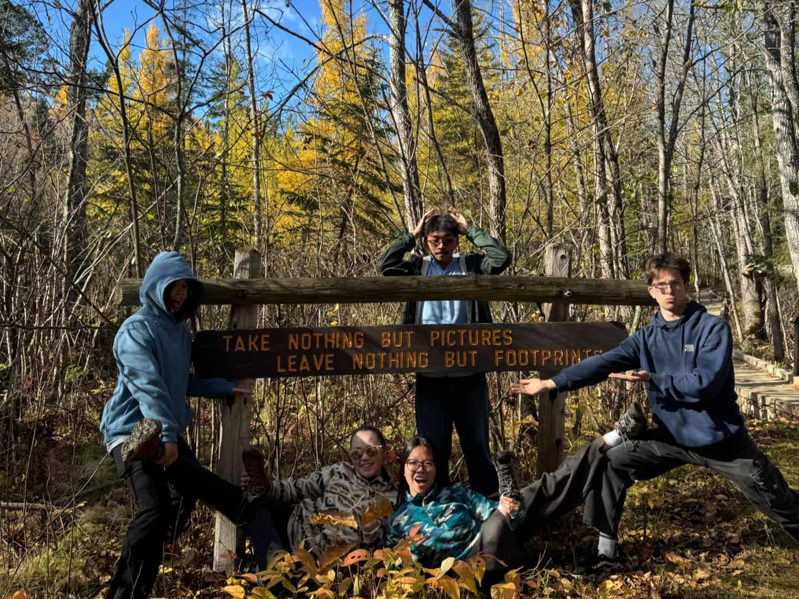

##  i love being in lab! 

I am a member of the Lipid Lab and we are currently investigating the mechanisms of lipid droplet synthesis and degradation in *Tetrahymena thermophila*! I am also an internationally certified [Supplemental Instruction](https://info.umkc.edu/si/) leader for introductory chemistry courses, namely CHEM 122: Introductory Chemistry and CHEM 126: Energies and Rates of Chemical Reaction. 

::: {.center-text .small-text .dark-gray-text .topbr}
Me in the lab!
:::

##  i love hiking! 

::: {.center-text .extra-small-text .dark-gray-text .topbr}
While in Georgia! Kojori to Asureti hike!
:::

::: {.center-text .extra-small-text .dark-gray-text .topbr}
Somewhere in Armenia :) Pretty sure it was in Areni!
:::

::: {.center-text .extra-small-text .dark-gray-text .topbr}
Itasca State Park during Fall Break!
:::

